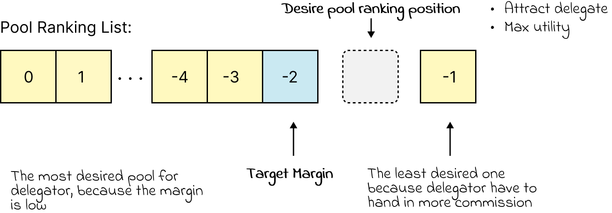

# Understanding Ethereum Stakeholder Profiles

The purpose of this simulation is to replicate real-world Ethereum pooling behaviors. However, upon further exploration, I've expanded it to include various types of stakeholders to enhance the depth of understanding.

### Agent State

ETH Stakeholders are characterized by attributes such as the cost of opening a pool, their stake, their current strategy, and their potential new strategy. At the start of the simulation, agents are initialized with both a stake and cost.

In the initial round, the current strategy for all stakeholders is set to `None`. Additionally, at the beginning of each subsequent round, their new strategy is also set to `None`.

### Updating Strategies

Stakeholders have two potential strategies: delegation or operation. Under the "operation" strategy, they can choose to operate a liquid pool (one that's not private) where others can stake, or they can operate a solo pool.

During each step of the simulation, stakeholders analyze their current options and update their strategy accordingly. The process involves evaluating potential utility and choosing the most optimal approach:

- **Delegate Strategy:** Stakeholders allocate all their stake to delegation to gauge potential outcomes and calculate utility. It's important to note that stakeholders act semi-synchronously, following a random order of activation, which means they are myopic and lack the ability to foresee future pool or simulation states. For instance, in the initial simulation step, the first agent in the order might lack the choice to delegate due to the absence of pools, forcing them to opt for operating a pool instead.
- **Pool Operation Strategy:** This strategy varies across different stakeholder profiles, which are further explained below.

After considering these two potential strategies, stakeholders compare them with their current strategy to determine if they can maximize profits by making a strategic shift.

### Executing Strategies

Should a new strategy be more advantageous, stakeholders execute it. This involves discontinuing their previous pools and initiating new ones based on the updated strategy. Simultaneously, they adjust their delegation. If no stakeholders stand to gain from altering their strategy, an equilibrium state is reached.

## Easy ETH stakeholder

The Easy ETH Stakeholder profile closely mirrors real-world scenarios. These stakeholders possess the flexibility to choose from established liquid contracts, similar to how real-world ETH holders can opt for solo staking or leverage liquid protocols such as Lido or Rocket Pool.

Given a consistent minimum effective balance, choosing solo staking proves more advantageous. This selection entails lower operational costs. While the expenses associated with their second pool might be more cost-effective than the first, these costs still tend to surpass those of delegation and liquidity. Stakeholders perform cost calculations based on their specific cost and protocol margin, subsequently ranking their choice between solo and liquid strategies. In instances where stakeholders have a substantial stake, selecting solo staking generally results in greater utility.

For Easy ETH stakeholders, their ability to accurately assess their strategy often leads to a rapid attainment of equilibrium.

## Hard ETH stakeholder 

Easy stakeholder is more align with real world. They can choose from different extablished liquid contract just like in realworld ETH holder can choose solo stake or use liquid protocol like lido or rocket pool. However in hard ETH stakeholders, they can choose the margin of their liquid pool. But the min pledge requirements is fixed.

### Pool Operation strategy

**Beginner**: If they are beginner, they will be more rational and limited with information. To be more frankly, they don't have the access to explore the pool ranking to decide their margin.  All is depend on their stake:

- not able to open liquid pool: they are not eligble to do any pool opertaion, they can only delegate
- able to open liquid pool but not solo: they will open one solo pool with `margin=margin_0+random_boost` 
- able to open solo:  They might have many stake but they can only use 1 unit of stake(alpha) in pool operation just to test the water: 1 solo pool(max pledge to beta) or 2 liquid pool with same margin `margin=margin_0+random_boost`.

**Not Beginner**: If they have experience opening a pool, they are facing options:

- Increase Pool: They can use one unit stake to 1. open one solo pool 2. open two liquid pool 3. open one liquid pool
- Decrease Pool: They can use take away one unit stake from 1. close one solo pool 2. close two liquid pool 3.close one liquid pool
- Reset Margin: They can remain the number of pools they are having, but reset their margin based on current pool ranking situation.

So with the given options they can choose, they will find suitable margin for the pools, and then calculate the utility of these options, with the highest one be the Pool operation strategy.

### Margin Selection

The primary objective of the margin selection process is to optimize profit for stakeholders.

When it comes to delegation and solo staking, the reward is entirely reliant on the reward scheme, and thus remains unaffected by stakeholder selection.

For stakeholders possessing enough stake to engage in solo or liquid operations, the key strategy is to maximize profit by operating a liquid pool with a substantial margin. This specific margin is known as "margin_0," and it surpasses both the solo and delegate margins. This can be expressed as:

- When using margin_0: `solo_utility(alpha) = liquid_utility(alpha)`

On the other hand, stakeholders with sufficient stake solely for liquid operations opt for operating a liquid pool only when the profit potential outweighs that of delegation. Hence, margin_0 is considered more favorable than the delegate margin. This translates to:

- When using margin_0: `liquid_utility(alpha) = delegate_utility(alpha)`

In terms of the number of liquid pools a stakeholder aims to operate, they strategically aim for the second-to-last position in the existing pool ranking. This position is advantageous as it's attractive to delegates and offers a higher ranking than the last one, resulting in optimized utility.

Consequently, stakeholders calculate their "potential margin," which is derived from the "Target Margin" plus a random boost falling within the range of (1e-3, 1e-2). This potential margin usually scales around 1e-1.

If the potential margin surpasses margin_0, it becomes the chosen margin. Otherwise, stakeholders refrain from opening a liquid pool because this operation will cost them loss.

## ETH Stakeholder- Solo

The Solo ETH Stakeholder profile envisions a scenario without supplementary liquid staking alongside Ethereum staking. Agents in this context are solely empowered to open solo pools. Stakeholders with sufficient stakes to become validators on the beacon chain maximize their involvement by opening as many solo pools as their stakes permit. Meanwhile, stakeholders who don't meet validator prerequisites lack the option of solo pool operation and liquid pool delegation. Their sole choice is to retain their stake without active engagement.
